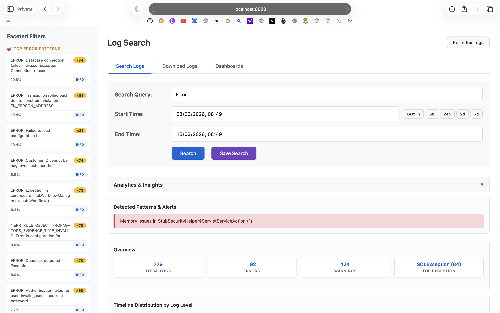
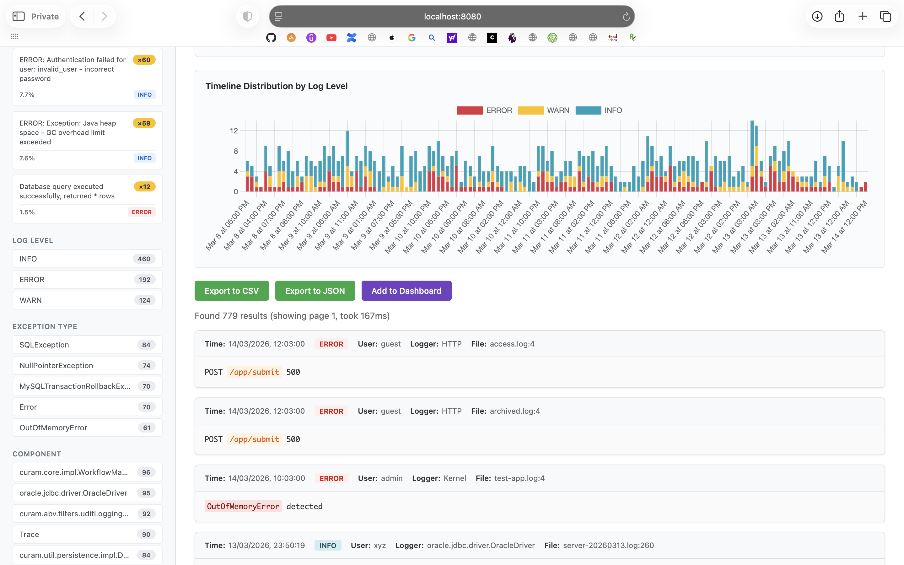
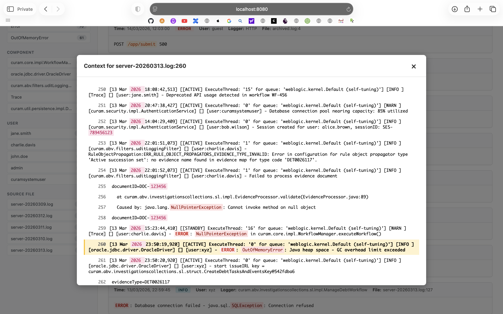
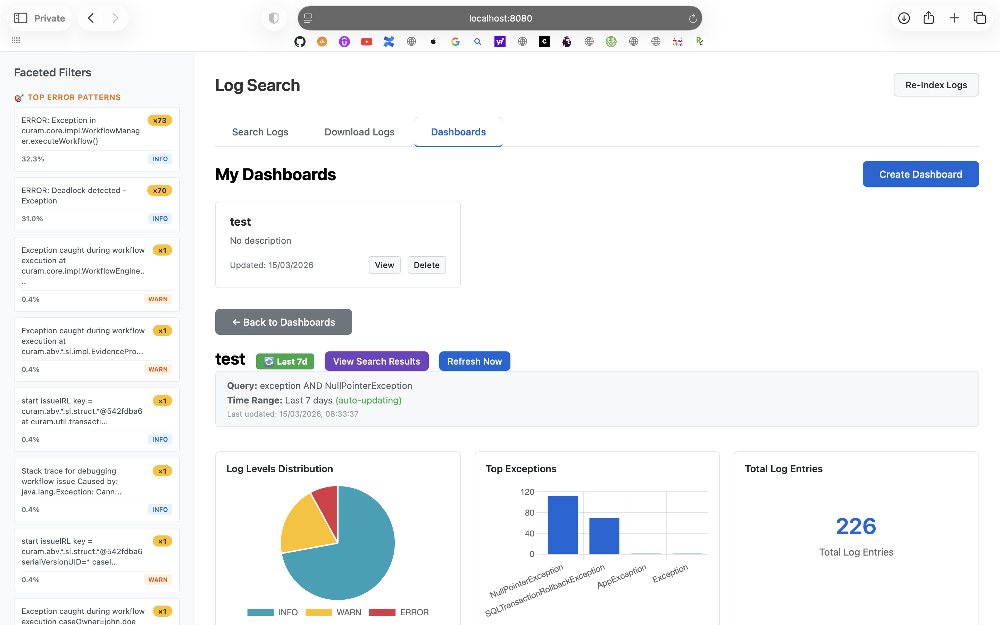

# LogSearch

**Fast, lightweight search for archived application logs.**

LogSearch is a developer-focused log investigation tool designed for teams that cannot retain large volumes of logs in expensive observability platforms such as Splunk.

Many organizations must periodically delete logs from Splunk or other centralized systems due to license or storage constraints. When incidents occur later, developers often need to manually download large log files and search them line-by-line using tools like `grep` or text editors.

LogSearch solves this problem by allowing developers to **index and search historical logs locally with high performance using Apache Lucene**.

It provides fast full-text search, stack trace awareness, date filtering, analytics dashboards, and contextual log viewing — all packaged in a **single lightweight application with no external dependencies**.

---

# Problem This Solves

In many engineering environments:

• Splunk or similar tools retain logs for only a short period due to license costs
• Older logs are archived to files or object storage
• Developers must manually download and search logs
• Investigations become slow and inefficient

Typical developer workflow today:

```
Download logs
Open huge files
Run grep commands
Scroll through stack traces
Repeat across multiple files
```

This process can take **hours for a single investigation**.

LogSearch provides a faster alternative.

```
Archived logs
      │
      ▼
Index using Lucene
      │
      ▼
Search instantly
      │
      ▼
View stack traces and context
```

Instead of searching raw files, developers query a **high-performance index**.

---

# Screenshots

### Search Interface with Pattern Fingerprinting



**Key Features Shown:**
- Faceted navigation with TOP ERROR PATTERNS sidebar
- Pattern fingerprinting (e.g., "Database connection failed - java.sql.Exception: Connection refused")
- Quick analytics: Total logs, Errors, Warnings, Top exception types
- Detected patterns and alerts
- Time range selector (Last 1h, 6h, 24h, 7d)

### Search Results with Timeline Visualization



**Key Features Shown:**
- Timeline distribution by log level (stacked bar chart)
- Log level facets (INFO: 460, ERROR: 192, WARN: 124)
- Exception type facets (SQLException, NullPointerException, OutOfMemoryError)
- Component/package facets for code-aware filtering
- Syntax-highlighted search results
- Export options (CSV, JSON, Add to Dashboard)
- Performance metrics (e.g., "took 167ms")

### Context View with Stack Traces



**Key Features Shown:**
- Full context view showing log lines before and after selected event
- Multi-line stack trace handling
- Syntax highlighting for exceptions, error keywords, file paths
- Line-by-line navigation
- Color-coded log levels (ERROR, WARN, INFO)

### Dashboards with Analytics Widgets



**Key Features Shown:**
- Custom dashboards with auto-refresh
- Log levels distribution (pie chart)
- Top exceptions (bar chart)
- Total log entries counter
- Dashboard management (View, Delete, Refresh)
- Pattern fingerprinting in sidebar for quick filtering

---

# Key Benefits

### Fast Investigation

Lucene-based indexing enables near-instant search across large log files.

### Historical Log Access

Investigate incidents even after logs have been removed from Splunk.

### Developer Friendly

Designed specifically for engineers investigating application logs.

### Zero Infrastructure

Runs as a **single Java application** with no external services required.

### Lightweight Alternative

Keeps Splunk for operational monitoring while enabling low-cost historical search.

---

# Code-Aware Log Search

**Unlike traditional log search tools, LogSearch understands Java code structures.**

Most log search tools treat logs as plain text. LogSearch is built specifically for **application logs** and understands:

### CamelCase Tokenization
Searches automatically split Java class names and method names.

Example:
```
Search: "NullPointer"
Matches: NullPointerException, NullPointerWarning
```

You don't need to type the full exception name — search for any component.

### Package-Aware Indexing
Java package paths are automatically broken into searchable components.

Example:
```
Log line: com.company.service.payment.PaymentValidator
Searchable as: "PaymentValidator", "payment", "service", "company"
```

### Stack Trace Intelligence
Multi-line stack traces are treated as **single searchable events**.

Example:
```
java.lang.NullPointerException: Cannot process null payment
    at com.company.service.PaymentService.process(PaymentService.java:123)
    at com.company.controller.PaymentController.execute(PaymentController.java:45)
```

Searching for `PaymentService` returns the entire stack trace — not just the line where it appears.

### Why This Matters

Traditional tools require exact matches or complex wildcards:
```
grep "com.company.service.payment.PaymentValidator"  ❌ Too specific
grep "*PaymentValidator"                             ❌ May not work
```

LogSearch allows natural searches:
```
PaymentValidator  ✅ Just works
Validator         ✅ Matches any validator
payment           ✅ Finds payment-related code
```

**This makes debugging significantly faster.**

---

# Core Features

## Full-Text Log Search

Search across indexed logs using powerful text queries.

Examples:

```
NullPointerException
payment failed
timeout AND retry
"database connection"
```

---

## Date and Time Filtering

Restrict searches to a specific time window.

Example:

```
2026-03-12 10:00 → 2026-03-12 12:00
```

This significantly reduces search time when working with large datasets.

---

## Java Stack Trace Awareness

LogSearch understands multi-line stack traces.

Instead of breaking them across lines, stack traces are stored as **single searchable events**.

Example:

```
java.lang.NullPointerException
    at com.company.service.PaymentService.process()
    at com.company.controller.PaymentController.execute()
```

---

## Context View

See log lines before and after the event.

Example:

```
Previous logs
Target log event
Following logs
```

This makes debugging faster by showing surrounding activity.

---

## Incremental Indexing

Only new logs need to be indexed.

This avoids reprocessing entire log archives.

---

## Full Reindex

If needed, the entire index can be rebuilt.

Useful when log formats change or new parsing rules are added.

---

## Log Analytics

LogSearch can generate quick summaries such as:

• error counts
• warning counts
• log frequency over time

This helps identify spikes and unusual patterns.

---

## Pattern Fingerprinting

Automatically identifies and groups similar log messages by extracting normalized patterns.

Example:

```
Original logs:
  ERROR: Failed to connect to database at 192.168.1.1
  ERROR: Failed to connect to database at 192.168.1.2
  ERROR: Failed to connect to database at 192.168.1.3

Pattern detected:
  ERROR: Failed to connect to database at <IP>  (×3 occurrences)
```

Benefits:
• Quickly identify the most common error patterns
• See percentage distribution of error types
• Click a pattern to view all matching logs
• Spot recurring issues across different contexts

The UI displays "🎯 TOP ERROR PATTERNS" showing:
• Pattern text with variables normalized
• Occurrence count
• Percentage of total logs
• Log level (ERROR, WARN, INFO)

---

## Smart Format Detection

Automatically detects log formats from various server types with **zero configuration**.

### Supported Formats

Built-in support for common application servers:
• **WebLogic** - `[timestamp] [thread] [level] [logger] [] [user:xxx] - message`
• **WebSphere** - `[timestamp] [thread] level logger [user] message`
• **Tomcat/Log4j** - `timestamp [thread] level logger - message`
• **ISO-8601** - `2026-03-12T14:30:45.123+13:00 level message`
• **Custom application formats** - Flexible pattern matching

### Multi-Tier Parsing Strategy

LogSearch uses a **graceful fallback system** to ensure logs are always parsed:

**Tier 0: Smart Auto-Detection** (Primary)
- Tries built-in patterns for WebLogic, WebSphere, Tomcat, etc.
- Detects format on first successful match
- Caches detected format per file for performance

**Tier 1: Configured Pattern** (Fallback)
- Uses pattern from `application.yml` if auto-detection fails
- Allows custom format specification if needed

**Tier 2+: Progressive Fallbacks**
- Extracts timestamp and message with relaxed parsing
- Ensures no log lines are dropped
- Always indexes something, even if format is unusual

### Handling Mixed Formats

**Multiple log files, different formats:**
```
logs/
  ├── weblogic-server.log     → Detected as WebLogic format
  ├── tomcat-application.log  → Detected as Tomcat format
  └── custom-service.log      → Detected as custom format
```

Each file's format is detected independently and cached. No manual configuration needed.

**Format changes within a file:**
- If format changes mid-file, system adapts automatically
- Each line is parsed with best-matching pattern
- No re-indexing required

### Benefits

• **Zero configuration** - Works out of the box with standard server logs
• **Graceful degradation** - Always extracts something, never fails completely
• **Mixed format support** - Handle WebLogic + Tomcat + custom in same directory
• **Performance** - Per-file format caching avoids repeated detection
• **Reliability** - Multi-tier fallback ensures robust parsing

Simply drop logs into the directory and search — format detection happens automatically.

---

## Dashboard View

Provides a quick overview of log activity including:

• log volume
• error distribution
• time-based patterns

---

## Saved Searches

Common queries can be saved and reused.

Example:

```
payment failures
authentication errors
database timeouts
```

---

## Bulk Log Download

Search results can be downloaded for offline analysis or sharing with team members.

---

# Architecture Overview

## Metadata-First Search Architecture (NEW!)

LogSearch now includes an **optional metadata-first search architecture** that scales to 100GB+ log volumes with 90-98% pruning efficiency.

### Two-Stage Search Flow

```
┌──────────────────────────────────────────────────────────┐
│  User Query: "error database timeout"                    │
│  Time Range: Last 7 days (100GB of logs)                 │
└───────────────────────┬──────────────────────────────────┘
                        │
                        ▼
         ┌──────────────────────────────┐
         │  Stage 1: Metadata Index     │ ← Sub-millisecond
         │  • Bloom filter term check   │
         │  • Time range filter         │
         │  • Result: 3 candidate       │
         │    chunks (97% pruned)       │
         └──────────────┬───────────────┘
                        │
                        ▼
         ┌──────────────────────────────┐
         │  Stage 2: Chunk Search       │ ← Parallel
         │  • Search only 3 chunks      │
         │  • Full-text in parallel     │
         │  • Merge & sort results      │
         └──────────────┬───────────────┘
                        │
                        ▼
              Return paginated results
```

### Architecture Diagram

```
┌─────────────────────────────────────────────────────────────┐
│                        Log Files                            │
│  (WebLogic, WebSphere, Tomcat, Log4j, Custom formats)      │
└──────────────────────────┬──────────────────────────────────┘
                           │
                           ▼
┌─────────────────────────────────────────────────────────────┐
│                   Smart Log Parser                          │
│  • Auto-detect format (WebLogic/WebSphere/Tomcat/etc.)     │
│  • Extract timestamp, level, user, message, thread          │
│  • Multi-line stack trace handling                          │
│  • Pattern fingerprint extraction                           │
└──────────────────────────┬──────────────────────────────────┘
                           │
                           ▼
                  ┌────────────────┐
                  │ Adaptive       │ ← NEW: Chunking enabled
                  │ Chunking       │   (150-250 MB chunks)
                  └────────┬───────┘
                           │
        ┌──────────────────┴──────────────────┐
        │                                     │
        ▼                                     ▼
┌───────────────┐                 ┌──────────────────────┐
│Content Index  │                 │  Metadata Index      │ ← NEW
│(Lucene)       │                 │  • Chunk summaries   │
│• Day-based    │                 │  • Bloom filters     │
│• Code-aware   │                 │  • Time ranges       │
│• Faceting     │                 │  • Top terms         │
└───────────────┘                 └──────────┬───────────┘
                                             │
                                             ▼
                                  ┌─────────────────────┐
                                  │  Two-Stage Search   │ ← NEW
                                  │  1. Metadata prune  │
                                  │  2. Chunk search    │
                                  └──────────┬──────────┘
                                             │
                                             ▼
┌─────────────────────────────────────────────────────────────┐
│                    REST Search API                          │
│  • /api/search - Metadata-first or standard search          │
│  • /api/context - Get surrounding log lines                 │
│  • /api/facets - Get aggregations (ERROR/WARN counts)       │
│  • /api/patterns - Get top error patterns                   │
└──────────────────────────┬──────────────────────────────────┘
                           │
                           ▼
┌─────────────────────────────────────────────────────────────┐
│                    Web UI (Single Page)                     │
│  • Search with syntax highlighting                          │
│  • Faceted navigation (levels, patterns, users)             │
│  • Dashboard widgets with auto-refresh                      │
│  • Bulk log download from URLs                              │
└─────────────────────────────────────────────────────────────┘
```

### When to Use Metadata-First Search

**Enable chunking (`chunking.enabled: true`) when:**
- Log volumes exceed 50GB
- Search performance degrades with standard indexing
- You need predictable sub-second search times at scale

**Use standard search (`chunking.enabled: false`) when:**
- Log volumes are under 50GB
- Faster indexing is preferred over search optimization
- Simpler architecture is desired

**Key Design Decisions:**

1. **Dual-mode operation**: Automatically routes between metadata-first and standard search based on configuration
2. **Adaptive chunking**: Creates 150-250 MB chunks with 15min-6hr duration for optimal balance
3. **Bloom filter pruning**: Eliminates 90-98% of chunks before full-text search
4. **Date-partitioned indexes**: Each day gets its own Lucene index, enabling parallel search across date ranges
5. **Code-aware tokenization**: Java class names, exceptions, and packages are split intelligently for natural search
6. **Zero-config format detection**: Built-in patterns for common server types (WebLogic, WebSphere, Tomcat)
7. **Single-JAR deployment**: No external dependencies — just run the JAR file

---

# Technology Stack

| Component     | Technology        |
| ------------- | ----------------- |
| Language      | Java 8+           |
| Search Engine | Apache Lucene 8.11.2 |
| Packaging     | Standalone JAR    |
| Storage       | Local file system |
| Indexing      | Incremental       |
| Concurrency   | Parallel search   |

---

# Performance

LogSearch is designed for **enterprise-scale workloads** with two operating modes:

**Performance measured on:**
- 8-core CPU
- 16GB RAM
- SSD storage

## Standard Search Performance (chunking disabled)

### Throughput
- **1-2 GB/day**: Optimized for small teams
- **5-10 GB/day**: Production-ready with default settings
- **10-20 GB/day**: Supported with tuned heap configuration
- **20-50 GB/day**: Approaching limits (consider metadata-first)

### Search Speed
- **Single day**: 100-300ms
- **7 days**: 300-500ms (parallel search)
- **30 days**: 1-3 seconds

## Metadata-First Search Performance (chunking enabled)

### Throughput
- **50-100 GB/day**: Optimized range
- **100GB+ logs**: Scales predictably with 90-98% pruning

### Search Speed (with 90-98% pruning)
- **7 days (100GB)**: < 500ms (97% of chunks eliminated)
- **30 days (500GB)**: 1-2 seconds (98% pruning efficiency)
- **Search time is proportional to matching chunks, not total data**

### Pruning Efficiency
- **Bloom filter lookup**: < 1ms per chunk
- **Typical pruning rate**: 90-98% of chunks eliminated before search
- **Example**: 100 chunks → 2-10 candidates searched

### Architecture Comparison

| Feature | Standard Search | Metadata-First Search |
|---------|----------------|---------------------|
| **Best for** | < 50GB logs | 50GB+ logs |
| **Indexing speed** | Faster | Slower (metadata extraction) |
| **Search speed** | Scales linearly | Sub-second at massive scale |
| **Predictability** | Varies with data size | Consistent (pruning-based) |
| **Complexity** | Simpler | Advanced |

### Parallel Search Architecture
Searches across multiple day-based indexes run **concurrently** using thread pools, providing 3-5x performance improvement over sequential search. This applies to both standard and metadata-first modes.

### JVM Auto-Configuration
Heap size is automatically configured from `application.yml`:
```yaml
jvm:
  heap-min: 2g    # Default for small workloads
  heap-max: 4g    # Increase for enterprise scale
```

**Recommended settings by workload:**

| Mode | Daily Volume | heap-min | heap-max |
|------|-------------|----------|----------|
| Standard | 1-10 GB | 2g | 4g |
| Standard | 10-20 GB | 4g | 8g |
| Standard | 20-50 GB | 8g | 12g |
| Metadata-First | 50-100 GB | 8g | 16g |
| Metadata-First | 100GB+ | 16g | 24g |

---

# Typical Workflow

### Step 1

Download archived logs.

Example:

```
server-20260312.log
server-20260313.log
server-20260314.log
```

---

### Step 2

Index the logs using the startup script (with auto-configured JVM settings).

```bash
./start.sh index
```

Or run directly:
```bash
java -jar logsearch.jar index
```

---

### Step 3

Start the web server.

```bash
./start.sh
```

This automatically:
- Reads JVM heap settings from `config/application.yml`
- Applies optimal garbage collection settings
- Starts the application with parallel search enabled

---

### Step 4

Search via the web UI at `http://localhost:8080` or API:

```bash
curl "http://localhost:8080/api/search?query=NullPointerException&startTime=..."
```

---

### Step 5

Investigate results with context and stack traces through the web UI.

---

# Configuration

LogSearch uses externalized configuration in `config/application.yml`.

### JVM Configuration

Control heap size and GC settings:

```yaml
jvm:
  heap-min: 2g     # Minimum heap
  heap-max: 4g     # Maximum heap
  extra-opts: -XX:+UseG1GC -XX:MaxGCPauseMillis=200
```

**Recommended settings by workload:**

| Daily Log Volume | heap-min | heap-max |
|-----------------|----------|----------|
| 1-2 GB          | 2g       | 4g       |
| 5 GB            | 4g       | 6g       |
| 10 GB           | 8g       | 12g      |
| 20+ GB          | 16g      | 24g      |

### Environment Variable Override

```bash
export JVM_HEAP_MAX=8g
./start.sh
```

### Log Configuration

```yaml
log-search:
  logs-dir: ./logs
  index-dir: ./.log-search/indexes
  retention-days: 30
  auto-watch: true

  # NEW: Metadata-First Search Configuration
  chunking:
    enabled: true                # Enable metadata-first search
    strategy: "ADAPTIVE"         # ADAPTIVE or HOURLY
    adaptive:
      target-size-mb: 200        # Target chunk size: 150-250 MB
      min-duration-minutes: 15   # Minimum chunk duration
      max-duration-hours: 6      # Maximum chunk duration

  metadata:
    top-terms-count: 50                    # Terms to index per chunk
    enable-package-extraction: true        # Extract Java packages
    enable-exception-extraction: true      # Extract exception types
    bloom-filter:
      enabled: true                        # Enable Bloom filter pruning
      false-positive-rate: 0.01            # 1% false positive rate
      estimated-terms-per-chunk: 10000     # Expected unique terms
```

**Directory Structure:**
```
./logs/                          # Source log files
./.log-search/indexes/           # Lucene indexes
├── 2026-03-10/                  # Day-based content index
├── 2026-03-11/
├── 2026-03-12/
└── metadata/                    # NEW: Metadata index (when chunking enabled)
    └── chunks/                  # Chunk metadata with Bloom filters
```

---

# Example Use Cases

### Production Incident Investigation

Search historical logs after they have been removed from Splunk.

---

### Debugging Failed Deployments

Quickly locate errors across multiple log files.

---

### Root Cause Analysis

Find the first occurrence of a failure.

---

### Performance Troubleshooting

Search for slow queries or timeout patterns.

---

# Why Not Just Use Splunk?

Splunk is powerful but expensive for long-term retention.

Many organizations keep only **7–30 days of logs** in Splunk.

Older logs are stored as files.

LogSearch allows teams to:

• keep Splunk costs under control
• retain access to historical logs
• enable developers to investigate issues independently

---

# Design Goals

LogSearch was designed with these principles:

• **Simple deployment**
• **High performance search**
• **Developer-focused workflow**
• **Minimal infrastructure requirements**

---

# When to Use LogSearch

LogSearch works best when:

• logs are archived outside Splunk
• developers need to investigate historical incidents
• teams want a lightweight search tool

---

# When Not to Use LogSearch

LogSearch is not intended to replace:

• Splunk
• ELK stack
• distributed observability platforms

Instead, it complements them by providing **low-cost historical search**.

---

# Future Enhancements

Planned improvements include:

• distributed indexing
• cloud storage integration
• faster indexing pipelines
• structured log parsing
• alert pattern detection

---

# Contributing

Contributions are welcome.

Possible areas to contribute:

• log parsers
• indexing improvements
• UI enhancements
• performance tuning

---

# License

This project is licensed under the MIT License.

---
